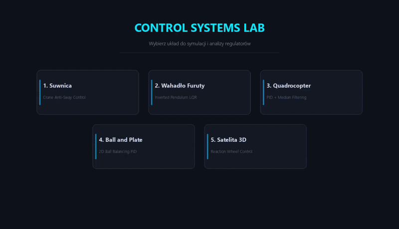

# 🚀 ESP32 IMU Control Systems Lab


<p align="center">
  <b>An advanced, real-time 3D physical simulation and control engineering testbed.</b><br>
  Integrates <b>Hardware-in-the-Loop (HIL)</b> dynamic stabilization via an <b>ESP32 + MPU6050 IMU</b> controller with high-fidelity OpenGL interactive rendering.
</p>

---

## 🎬 Demo

<p align="center">
  
</p>

---

## 📌 Things to Do (Roadmap)

- **Correct Objects Models** 
- **Data Logging & Export:** 
- **Cleaning code** 
- **Tune controllers and add new ones**
- **Translate to english**

---

## 🌟 Key Features

* **Real-Time 3D Visualization:** Powered by OpenGL and PyGame for smooth rendering of system dynamics.
* **Serial Communication (UART):** Real-time reading of orientation angles (Roll/Pitch) from the IMU connected to the ESP32.
* **Signal Filtering:** Implemented median filtering to eliminate sensor measurement noise.
* **Manual Mode (Hardware-Free):** Full fallback control via mouse and keyboard if no physical COM port is connected.
* **Dynamic Plotting & UI:** Real-time monitoring of Setpoint, Process Variable (PV), and control signals on interactive charts.

---

## 🎛️ Interactive Simulation Models

1. **🏗️ Crane Anti-Sway Control**
   * Overhead crane simulation with a suspended load.
   * Anti-sway stabilization algorithm damping payload oscillations during trolley movement.
2. **🌀 Furuta Pendulum (Rotary Inverted Pendulum)**
   * Control of a rotary inverted pendulum using State Feedback (haven't done swing-up yet).
3. **🛸 Quadrocopter (1D/2D Pitch/Roll PID)**
   * Angular stabilization and positional tracking based on IMU data.
4. **⚪ Ball and Plate**
   * Two-axis ball stabilization on a flat plate using dual PID loops.
5. **🛰️ Satellite (Reaction Wheel Control)**
   * Orientation control (One-axis) of a satellite via reaction wheel torque.

---

## 🛠️ Project Architecture

```text
ESP32_IMU_Control_App/
│
├── lib/                        # Custon MPU6050 libery
├── src/                        # [C++ / PlatformIO] Source code for ESP32 microcontroller
│   └── main.cpp                # Reads IMU (MPU6050) and streams telemetry over UART
├── platformio.ini              # PlatformIO environment configuration
│
├── python_app/                 # [Python] Simulation app & 3D visualization engine
│   ├── models/                 # Physics engines and mathematical models
│   ├── ui/                     # Graphical user interface components (Menu, Charts, Widgets)
│   ├── config.py               # Global simulation parameters and COM port settings
│   ├── renderers.py            # OpenGL geometry rendering functions
│   ├── serial_handler.py       # Serial port management
│   └── main.py                 # Application entry point and main loop
│
├── .gitignore
├── LICENSE
├── requirements.txt
└── README.md
```

---

## 📦 Requirements & Installation

### 1. Python Environment
Requires **Python 3.10+**.

Install the required dependencies:
```text
pip install -r requirements.txt
```

### 2. Firmware Flashing (PlatformIO)
1. Connect your ESP32 with the MPU6050 IMU to your computer.
2. Open the project folder in **VS Code** with the **PlatformIO** extension installed.
3. Build and upload the firmware using **PlatformIO: Upload**.

---

## 🚀 Getting Started

1. Ensure the correct serial port is specified in `python_app/config.py` (e.g., `COM8` or `/dev/ttyUSB0`).
2. Run the Python application:

```text
cd python_app
python main.py
```

---

## ⌨️ Controls & Shortcuts

* **Mouse (LMB):** Set target positions directly on the 3D viewport or adjust PID parameters (Kp/Kd) on the control panel.
* **`SPACE`:** Reset system state / clear target position.
* **`ESC`:** Return to the main simulation selection menu.

---

## 👤 Author

* **Ignacy Glura** – [*ignaczy*](https://github.com/ignaczy)

---

## 📜 License

This project is licensed under the MIT License - see the [LICENSE](LICENSE) file for details.